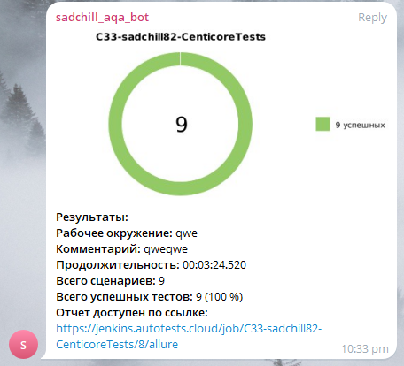
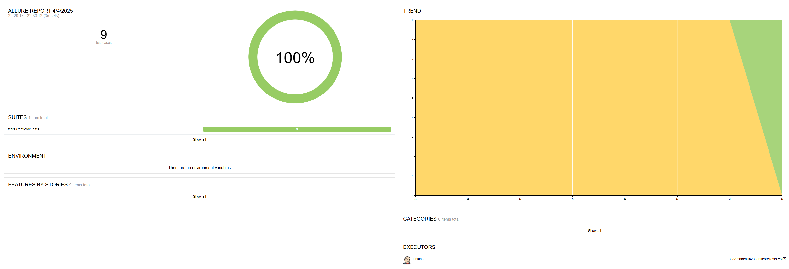
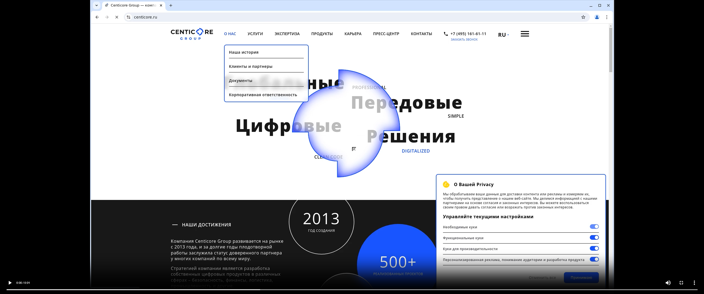

# 🧪 Centicore UI Automated Tests

Автоматизированные UI тесты для сайта [Centicore](https://centicore.ru), реализованные с использованием **Selenide**, **JUnit 5**, **Gradle** и **Allure**. Проект построен по принципу **Page Object**, что обеспечивает масштабируемость и читаемость автотестов.


---

## 🔧 Стек технологий

| Инструмент                                                                                                                            | Назначение                                |
|---------------------------------------------------------------------------------------------------------------------------------------|-------------------------------------------|
| [](https://www.oracle.com/java/)                 | Язык программирования                     |
| [](https://gradle.org/)                          | Система сборки                            |
| [](https://selenide.org/)                  | UI-фреймворк для браузерного тестирования |
| [](https://junit.org/junit5/)                | Тестовый фреймворк                        |
| [](https://docs.qameta.io/allure/)               | Отчёты о тестах                           |
| [](https://aerokube.com/selenoid/latest/)  | Запуск в Docker-контейнерах               |

---

## 📁 Структура проекта

- `centicore-ui-tests/`  
  ├─ `build.gradle` — Gradle билд-файл с зависимостями  
  ├─ `gradlew / gradlew.bat` — Gradle wrapper для Windows/Linux/Mac  
  ├─ `README.md` — Этот файл  
  └─ `src/`  
  &nbsp;&nbsp;&nbsp;&nbsp;├─ `main/java/pages/` — Page Object'ы (HomePage, ProductsPage, CareerPage, etc.)  
  &nbsp;&nbsp;&nbsp;&nbsp;└─ `test/java/tests/` — Тесты (CenticoreTests, TestBase)  

---

## 🚀 Запуск проекта

### 📌 Предусловия

- Java 11+
- Gradle (или `./gradlew`)
- Chrome + WebDriver (если запуск локально)
- Selenoid (если запуск в контейнере)

### 🔄 Сборка и зависимости

```bash
./gradlew clean build
```

### ▶️ Запуск тестов

```bash
./gradlew test
```

Запуск с Selenoid:

```bash
./gradlew clean test -DremoteUrl=http://localhost:4444/wd/hub
```

---

## 📊 Интеграция с Jenkins и Allure

**Jenkins Job:**  
Сборка проекта запускается через Jenkins. Перейти к последней сборке можно по ссылке:  
[Перейти к Jenkins](https://jenkins.autotests.cloud/job/C33-sadchill82-CenticoreTests/)

**Allure Отчёт:**  
Просмотр подробного отчёта после сборки доступен по ссылке:  
[Перейти к Allure](https://jenkins.autotests.cloud/job/C33-sadchill82-CenticoreTests/allure)

### Генерация отчёта

```bash
./gradlew allureReport
```

### Открытие в браузере

```bash
./gradlew allureServe
```

## Скриншоты и артефакты сборки

### Уведомление в Telegram

При успешной сборке в Jenkins через интеграцию (с использованием Telegram Bot API) отправляется уведомление в чат. Пример уведомления:



### Отчёт Allure

Скриншот Allure отчёта демонстрирует результаты прохождения тестов:



### Видео записи Selenoid

Для визуальной валидации тестов используется Selenoid, который сохраняет видео записи тестовых прогонах. Пример скриншота видео:



Полная запись видео:  
[Смотреть видео](https://jenkins.autotests.cloud/job/C33-sadchill82-CenticoreTests/8/allure/data/attachments/98b4a8814c95a5e.html)

---

## ✅ Покрытие тестами

Реализовано 10 автотестов, в т.ч.:

- Навигация на Products, Career, Contacts
- Проверка футера
- Проверка содержимого главной страницы
- Отображение вакансий
- Общая проверка открытия сайта

---

## 📃 Лицензия

Проект создан в рамках курса **QA.Guru** и предназначен для обучения. Свободно распространяется.
